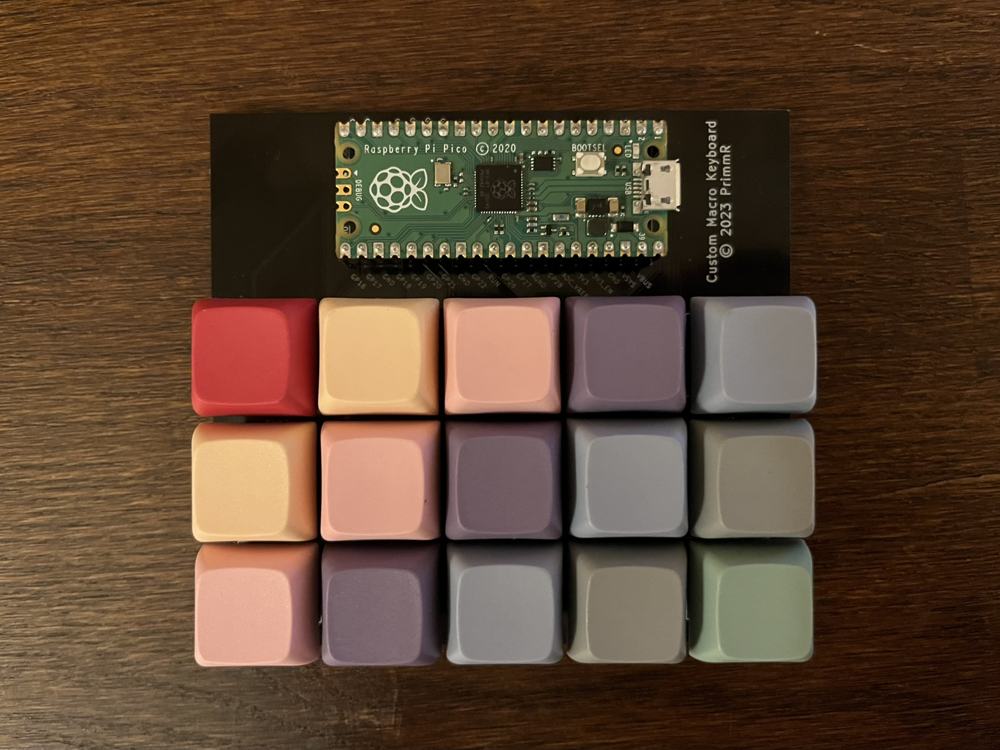
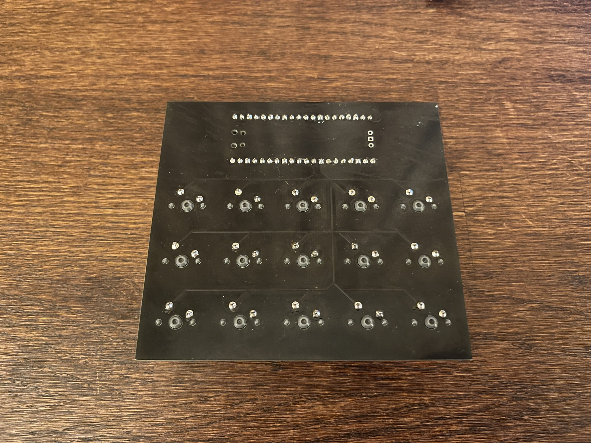

# Macro Keyboard

This small project is my own design for a mini macro keyboard, with the goal that it doesn't require any special software, just a simple USB connection, can send regular keystrokes if needed, and is cheap to build. Oh, and that it looks nice! It was my first time designing a PCB myself, so the circuitry is very small and simple. Despite this, it worked first time and provides a nice, inexpensive way to have a device that can act as a mini keyboard.

In default use, the device sends keystrokes of the non-accessible function keys, which can then be received and acted upon by a script. This means the device can act like a Stream Deck, a shortcut pad, or even a second controller for keyboard-based games.  
However it's completely possible to get the keyboard to send the raw keypresses just by itself, as the config file is easily modifiable.

## Gallery

Gallery/Vid.mp4

## Want to make one yourself?
This build is quite simple and only requires a few things! (If there is any ambiguity with any of the steps below, please contact me directly, and I'll do my best to help)

You will need:
- A Raspberry Pi Pico
- Two 20 length pin header sockets (can be trimmed to size)
- 15 Cherry MX style PCB mounted keyswitches
- 15 matching keycaps
- A USB micro cable
- Basic soldering skills 

Firstly, you will need to have the PCB manufactured. There are a variety of providers to choose from, but I used [PCBWay](https://www.pcbway.com/orderonline.aspx) for my own fabrication. Upload the Gerber file found [in the Board folder](Board) to the site. I set the min track spacing to 5mil and min hole size to 0.25mm, although it shouldn't particularly matter. You can then choose the colours for both the silkscreen and solder mask to taste. Please note that most providers have a minimum batch size of 5, so you're almost certainly going to end up with spare boards. 

Once all of your parts have arrived, you can get to soldering. I started with the Pico's socket first. It's much easier to solder with the Pico already in place, as it acts as a support to keep the sockets steady as they are being soldered to the board. Not all the pins need to be soldered, although it's recommended, as it means less stress will be applied to the important pins and it makes it harder to miss one that is needed. Once the socket has been installed, the Pico can be removed and installed without too much hassle. *Please make sure that the board is installed so that the USB input is coming into the right hand side*.

Then for the keys! I recommend putting on the caps before attempting to solder, as it provides a larger area to keep the key steady while the board is upside down. The keyswitches should fit snugly into the holes cut out for them. Then solder down the two pins of the key to the board. At this stage you may want to jump ahead to installing the software in order to check that you've installed the board and key correctly. If not, continue adding switches until all 15 spaces are filled.

Next, the software - connect your Raspberry Pi Pico to a computer. You will need to install [CircuitPython](https://circuitpython.org/downloads) onto it, with instructions how to do so being on the linked website. Then, download the CircuitPython HID library from [here](https://github.com/adafruit/Adafruit_CircuitPython_HID), and copy it to the root of the Pico. Finally, you can download the code from [the Pico folder](Pico) and also copy it to the root of the drive. Unplug the device and plug it back in again, to make sure all changes have been properly applied. 

Everything should now be set up!! If you left the files as the defaults, test it by pressing the top left key and seeing if it has the same effect as the `ESC` key. If it works, congratulations. I hope you get lots of use out of it! ^^

If you'd like to edit the keybinds, hold down the top left key on boot, which will let you see the board as a storage device again. Then copy and edit the `keys.py` with the key presses you want to be sent - just make sure the file you want to be used is renamed `keys.py`, otherwise it won't be used.  
Should you ever be unable to access the storage of the Pi, even after holding down the top left key, you can restore your Pi back to factory settings by holding down `BOOTSEL` and uploading [Flash Nuke](https://github.com/dwelch67/raspberrypi-pico/blob/main/flash_nuke.uf2) to the device.

*please note that I am not responsible for any issues that arise in the construction of this device*
